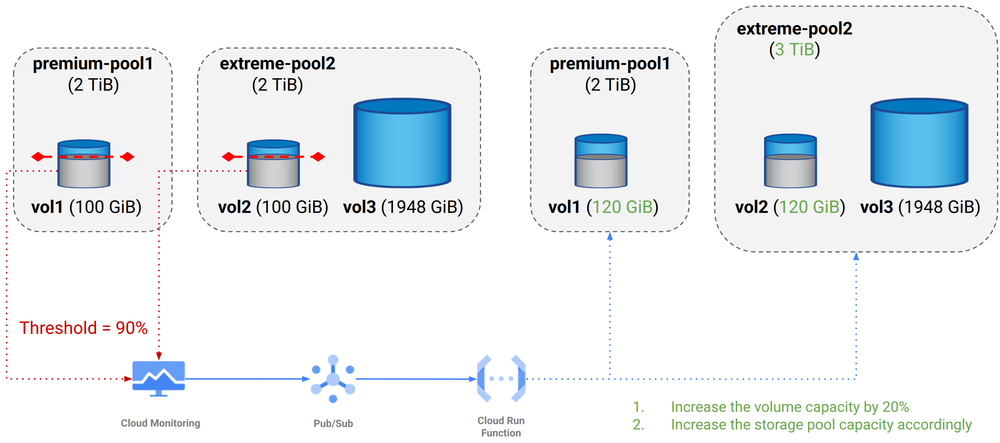
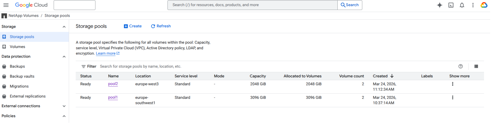
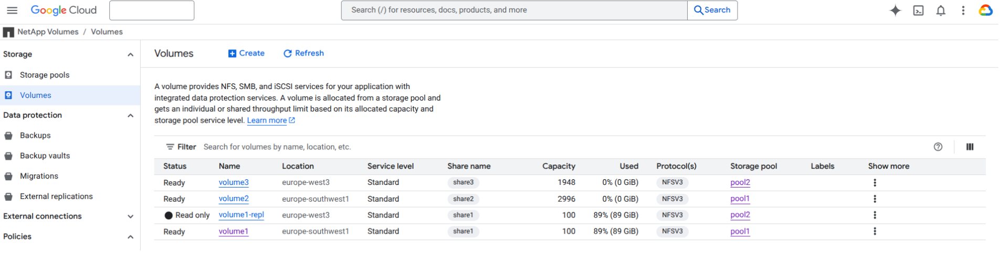
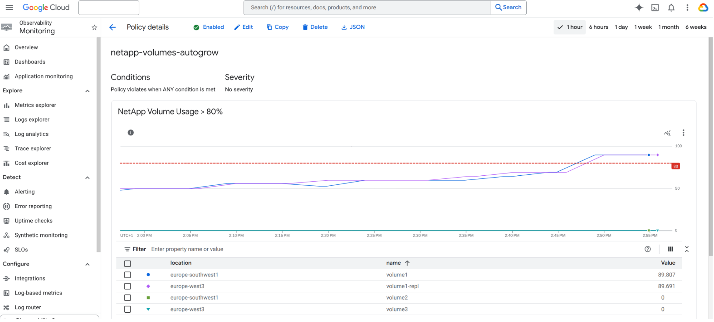
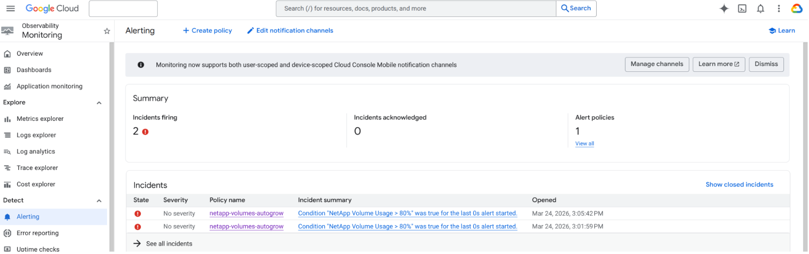
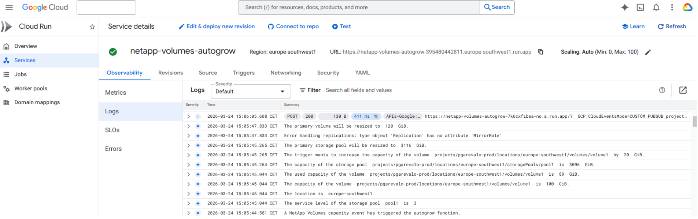
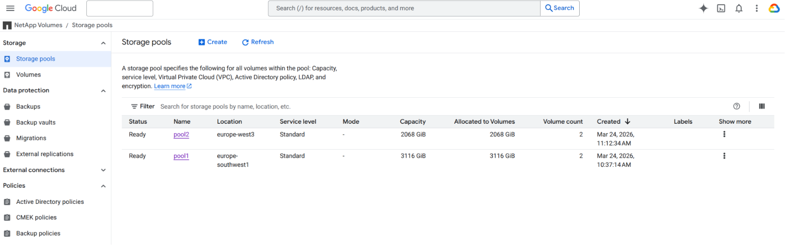
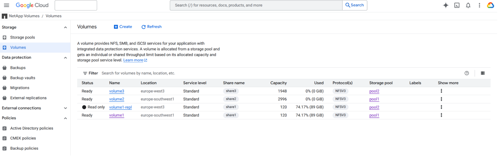
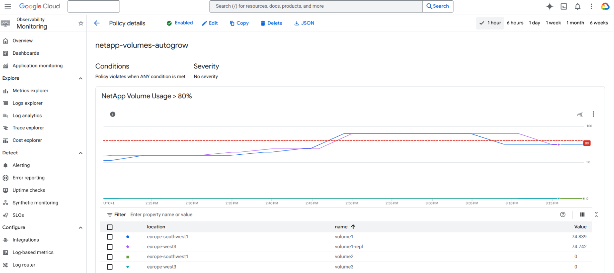

# Google Cloud NetApp Volumes Autogrow

This guide provides instructions and scripts to automatically increase the capacity of Google Cloud NetApp Volumes based on usage alerts. 



This function supports:

- **Multiple service levels**: Compatible with Standard, Premium, and Extreme volumes.
- **Dynamic storage expansion**: Automatically grows the source storage pool capacity if necessary.
- **Regional replication support**: Increases destination storage pool capacity for replicated volumes when required. (Note: NetApp Volumes automatically resize destination volumes following a primary volume capacity change).


Limitations:

- **Flex service level**: The Flex service level is not currently supported.

- **IaC compatibility**: Because storage capacity is modified dynamically, this script is incompatible with Infrastructure as Code (IaC) tools like Terraform, as it will cause "configuration drift".

---

## Deployment steps

Clone the script repository from GitHub and navigate to the project directory:

```bash
git clone https://github.com/GoogleCloudPlatform/storage-samples.git
cd "storage-samples/NetApp Volumes/Autogrow"
```
### 1. Required roles

Get the relevant information about your project.
```bash
PROJECT_ID="pgarevalo-prod"
REGION="europe-southwest1"
PROJECT_NUMBER=$(gcloud projects describe $PROJECT_ID --format="value(project_number)")
```
Create a service account with NetApp Volumes permissions to run the function.

```bash
gcloud iam service-accounts create netapp-volumes-autogrow --display-name="NetApp Volumes Autogrow" --description="Service account associated with the NetApp Volumes Autogrow"

gcloud projects add-iam-policy-binding $PROJECT_ID --member="serviceAccount:netapp-volumes-autogrow@$PROJECT_ID.iam.gserviceaccount.com" --role=roles/netapp.admin
```
Provide the required permissions to the service account that you will attach it to an Eventarc trigger.
```bash
gcloud projects add-iam-policy-binding $PROJECT_ID \
    --member=serviceAccount:$PROJECT_NUMBER-compute@developer.gserviceaccount.com \
    --role=roles/run.invoker

gcloud projects add-iam-policy-binding $PROJECT_ID \
    --member=serviceAccount:$PROJECT_NUMBER-compute@developer.gserviceaccount.com \
    --role=roles/eventarc.eventReceiver

gcloud projects add-iam-policy-binding $PROJECT_ID \
    --member=serviceAccount:$PROJECT_NUMBER-compute@developer.gserviceaccount.com \
    --role="roles/storage.objectViewer"

gcloud projects add-iam-policy-binding $PROJECT_ID \
    --member=serviceAccount:$PROJECT_NUMBER-compute@developer.gserviceaccount.com \
    --role="roles/cloudbuild.builds.builder"
```

### 2. Create the pub sub topic

```bash
gcloud pubsub topics create netapp-volumes-autogrow
```

### 3. Deploy the function

```bash
gcloud run deploy netapp-volumes-autogrow --project=$PROJECT_ID --region=$REGION \
    --source code \
    --function netapp_volumes_autogrow \
    --base-image python314 \
    --no-allow-unauthenticated \
    --service-account netapp-volumes-autogrow@$PROJECT_ID.iam.gserviceaccount.com
```

### 4. Create the eventarc

```bash
gcloud eventarc triggers create netapp-volumes-autogrow  \
    --location=$REGION \
    --destination-run-service=netapp-volumes-autogrow \
    --destination-run-region=$REGION \
    --event-filters="type=google.cloud.pubsub.topic.v1.messagePublished" \
    --transport-topic="projects/$PROJECT_ID/topics/netapp-volumes-autogrow" \
    --service-account=$PROJECT_NUMBER-compute@developer.gserviceaccount.com
```

### 5. Create the alert policy

Filter by the display name and extract only the ID (the last part of the path)
```bash
CHANNEL_ID=$(gcloud alpha monitoring channels list \
    --project=pgarevalo-prod \
    --filter="displayName='netapp-volumes-autogrow'" \
    --format="value(name)" | awk -F'/' '{print $NF}')
```

Create a temporal json file to create the alert policy.
```bash
cat <<EOF > alert-policy.json
{
  "displayName": "netapp-volumes-autogrow",
  "documentation": {
    "content": "Alert for NetApp volume usage exceeding 80%.",
    "mimeType": "text/markdown"
  },
  "conditions": [
    {
      "displayName": "NetApp Volume Usage > 80%",
      "conditionPrometheusQueryLanguage": {
        "query": "(avg_over_time(netapp_googleapis_com:volume_bytes_used{monitored_resource=\"netapp.googleapis.com/Volume\"}[1m]) * 100) / avg_over_time(netapp_googleapis_com:volume_allocated_bytes{monitored_resource=\"netapp.googleapis.com/Volume\"}[1m]) > 80",
        "duration": "0s",
        "evaluationInterval": "30s"
      }
    }
  ],
  "combiner": "OR",
  "enabled": true,
  "notificationChannels": [
    "projects/${PROJECT_ID}/notificationChannels/${CHANNEL_ID}"
  ],
  "alertStrategy": {
    "notificationPrompts": ["OPENED"]
  }
}
EOF
```

Create the policy using created json file.
```bash
gcloud monitoring policies create \
    --project=$PROJECT_ID \
    --policy-from-file="alert-policy.json"
```

You may need to create the service account `service-PROJECT_NUMBER@gcp-sa-monitoring-notification.iam.gserviceaccount.com` and grant the *pubsub.publisher* role.

```bash
gcloud pubsub topics add-iam-policy-binding \
  projects/$PROJECT_NUMBER/topics/netapp-volumes-autogrow \
  --role=roles/pubsub.publisher \
  --member=serviceAccount:service-$PROJECT_NUMBER@gcp-sa-monitoring-notification.iam.gserviceaccount.com \
  --project=$PROJECT_ID
```

## How it works

### Pre-Expansion NetApp Volumes Configuration

This example shows two Standard storage pools in different regions and some volumes within the storage pools. The volume `volume1` is replicated to the volume `volume1-repl`.





### Pre-Expansion alert policy view

The volume and its replicated volume grow and achieve the threshold. 



Two alerts are created.



### Function logs

The logs record all resize actions performed by the function.



### Post-Expansion NetApp Volumes Configuration

The example demonstrates how the function dynamically expanded the volume, as well as the primary and secondary storage pools.





### Post-Expansion alert policy view



